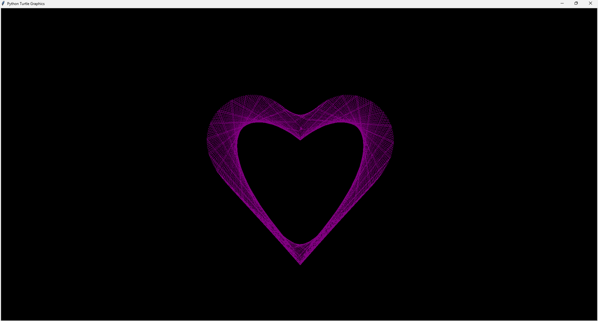
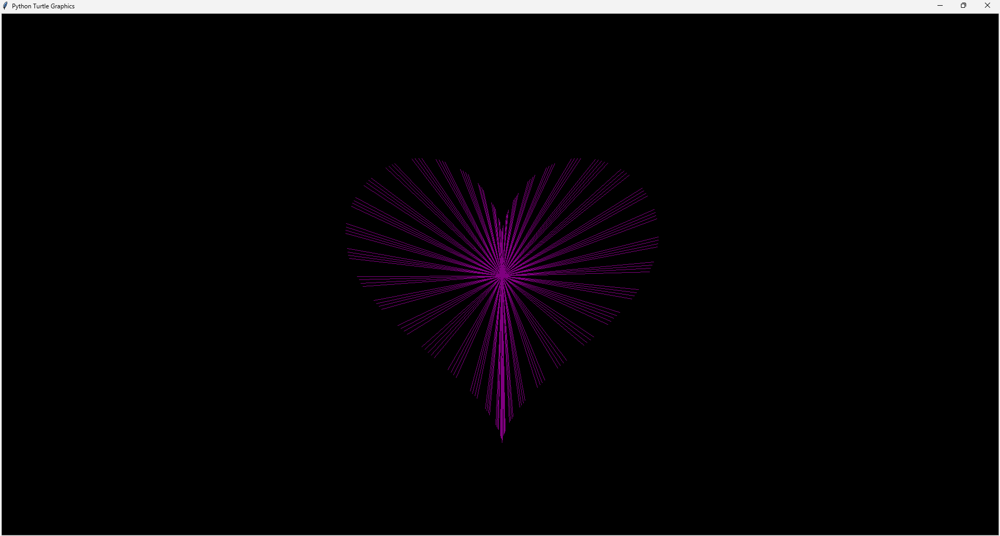

# Heart UI 💗

A creative Python project that generates beautiful heart visualizations using Turtle graphics.

## 📋 Overview

Heart UI is a collection of Python scripts that leverage the Turtle graphics library to create animated heart shapes. The project demonstrates the use of mathematical functions to generate aesthetic visualizations.

## ✨ Features

- Draws heart shapes using mathematical expressions
- Customizable colors (currently using purple/magenta)
- Smooth animations with thousands of points
- Simple and clean code

## 🛠️ Requirements

- Python 3.x
- Standard Python libraries:
  - `turtle`
  - `math`

## 💻 Installation

1. Clone this repository:

   ```bash
   git clone https://github.com/akosikhada/heart-ui.git
   cd heart-ui
   ```

2. No additional installation required as the project uses standard Python libraries.

## 🚀 Usage

Run either of the scripts to see the heart animation:

```bash
python heart-1.py
```

or

```bash
python heart-2.py
```

## 📊 Scripts

The repository contains two scripts:

### heart-1.py

- Creates a purple heart animation
- Points are drawn continuously

### heart-2.py

- Creates a similar heart but with a different animation style
- Each point connects back to the center

## 📸 Preview

<div align="center">
  <table>
    <tr>
      <td align="center">
        <strong>Heart Animation Style 1</strong><br>
        
      </td>
      <td align="center">
        <strong>Heart Animation Style 2</strong><br>
        
      </td>
    </tr>
  </table>
</div>

## 🧠 How It Works

The scripts use parametric equations to generate a heart shape:

- `x = 15 * sin(t)^3`
- `y = 12 * cos(t) - 5 * cos(2t) - 2 * cos(3t) - cos(4t)`

Where `t` is a parameter that varies over time.
